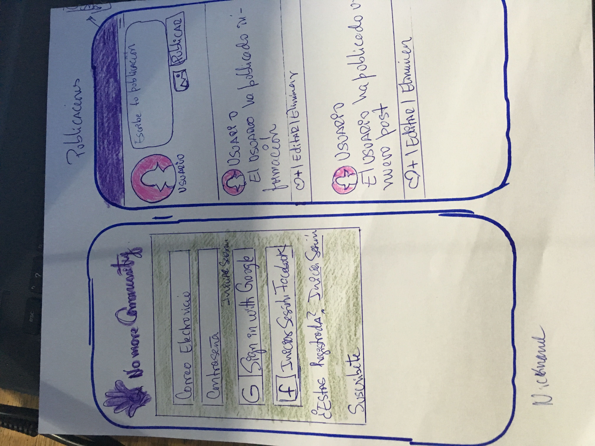
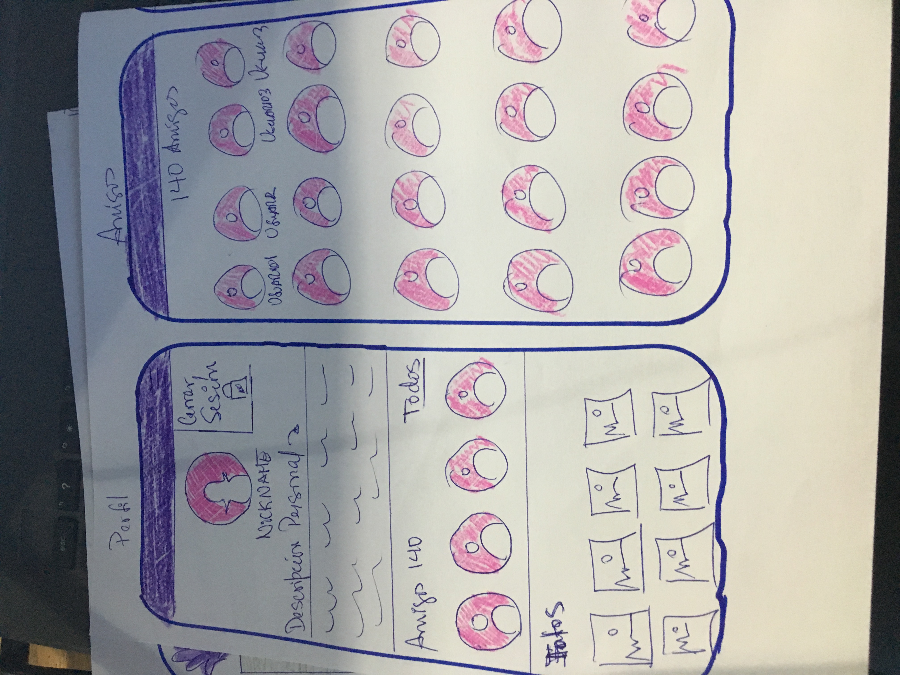

 
**NoMore!** :raising_hand:
En la sociedad actual, el empoderamiento femenino está ganando terreno cada día. Cada vez más existen más instancias donde las mujeres comenzamos a tener más oportunidades que antes estaban sesgadas para nosotras. Es una lucha que se seguirá desarrollando en los nuevos tiempos, pero también es innegable que aún faltan muchos vacíos que cubrir, sobre todo en el aspecto de la Violencia de género. 

Las estadísticas muestran que estas cifras no han disminuído, femicidios, violencia psicológica, física, sexual, monetaria, entre otras de las cuales son víctimas. Partiendo esta realidad, respondiendo a la necesidad de la creación de una red de apoyo para la comunidad, nace **NoMore!** :raising_hand:, la cual es una red social enfocada a prestarle apoyo y contención a mujeres que han sufrido algún tipo de violencia, de manera que puedan compartir sus experiencias en un entorno donde reine la confianza y la empatía, ya que somos conscientes que en estas situaciones, el apoyo es fundamental, venga de donde venga.

Se espera que esta red social, pueda tener un impacto positivo en la vida de las afectadas, tal como se mencionó anteriormente, generando una red de apoyo positiva para que puedan salir de estas situaciones y tengan una mejor calidad de vida.

**Planificación**
La planificación de esta red social se dividió en tres springs de una semana cada uno, la cual se puede visualizar en [Trello](https://trello.com/b/4FNgTDLU/creando-una-red-social), en la cual la primera semana se tuvo el prototipo de baja fidelidad que fue mejorando con las iteraciones de nuestras compañeras. Posterior a esto, se realizó el prototipo de alta fidelidad en [Figma](https://www.figma.com/file/0IPC8043071bzon4KGKWNhZa/NoMoreCommunity?node-id=0%3A1). Durante la planificación se realizaron las historias de usuario con sus criterios de aceptación y definición de terminado, para poder avanzar de forma ordenada.

 

**Test usabilidad**
[user 1]
[user 2]
[user 3]

**Modo de uso**
Esta aplicación se intentó realizar lo más minimalista posible, sin dejar de lado los detalles visuales que hagan la navegación más rápida, intuitiva y agradable para el usuario. En la primera pantalla se puede visualizar los campos de inicio de sesión con email y contraseña, además del inicio de sesión con Google, posteriormente se puede visualizar enlaces para el registro y recuperación de contraseña. Pueden acceder a NoMore! desde acá [link deploy here]

**HISTORIA DE USUARIO N°1**

Yo como usuaria de **NoMoreCommunity** QUIERO registrarme en la APP, mediante correo electrónico PARA poder usar la App

**Criterios de aceptación**
- Permitir al usuario registrarse mediante el ingreso de su alias, correo y contraseña, mediante un input  que capture el valor y lo envíe a firebase para guardar el registro. [Listo]
- Generar un msj de error si la contraseña es menor a 6 carácteres. [listo]
- Generar msj de error si alguno de los campos está vacío.[listo]
- Enviar correo al usuario de verificación de cuenta. [listo]
- Permitir que SÓLO ingresen a través del hash, los usuarios registrados. [listo]

**HISTORIA DE USUARIO N°2**
Yo como usuaria de **NoMoreCommunity** QUIERO poder restablecer mi contraseña, para usar la APP si la olvidé.

**Criterios de aceptación**
- Permitir al usuario restablecer su contraseña mediante un input que reciba su correo electrónico, y luego envíe el enlace de restablecimiento de la misma.[listo]
- Permitir volver a la pantalla de inicio.[listo]
- Validar que no existan campos vacíos [listo]

**HISTORIA DE USUARIO N° 3** 
YO como usuaria registrada en **NoMoreCommunity** QUIERO poder iniciar sesión mediante correo electrónico y contraseña PARA poder navegar en la misma.

**Criterios de aceptación**
- Permitir al usuario colocar el correo y contraseña, después validar si existe el usuario al clickear botón de LOGIN. [listo]
- Si el usuario no existe, enviar un mensaje que indique que no se encuentra registrado en la App. [listo]
- Si el usuario sí se encuentra registrado, permitir el ingreso mostrando el **muro general**.[listo]
- Si el usuario no recuerda su contraseña, enlace con la opción de recuperarla mediante envío de correo electrónico. [listo]

**HISTORIA DE USUARIO N° 4** 
YO como usuaria registrada en **NoMoreCommunity** QUIERO poder iniciar sesión mediante Google PARA poder navegar en la APP.

**Criterios de aceptación**
- Permitiar logearme en Google mediante un botón de la interfaz. [listo]

**HISTORIA DE USUARIO N° 5**
Yo como usuario loggeado de NoMoreCommunity, QUIERO poder cerrar sesión de mi cuenta PARA poder salir de la APP.
**Criterios de aceptación**
- Botón que cierre sesión y muestre la pantalla principal, con mensaje de despedida. [listo]

**HISTORIA DE USUARIO N° 6**
Yo como usuario de NoMoreCommunity, QUIERO que la APP me informe si tengo algún campo con error PARA poder verificar que lo que escribo es correcto en la APP.
**Criterios de aceptación**
- Mostrar al usuario los respectivos mensajes de error con los casos que se puedan presentar, campos vacíos, usuarios no registrados, etcétera. [listo]

**HISTORIA DE USUARIO N° 7** 
YO como usuaria loggeada de **NoMoreCommunity** QUIERO poder publicar un post, editarlo o eliminarlo, PARA poder compartir con las demás usuarias de la comunidad.

**Criterios de aceptación**
- Permitir al usuario redactar un post mediante un input, con opción a publicarlo.
- Permitir al usuario editar un post *in place* y republicarlo.
- Permitir al usuario eliminar un post, previa confirmación con **Alert** . 

